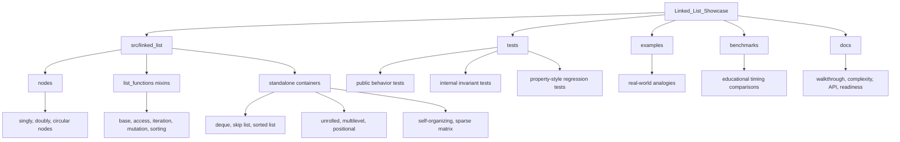

# Portfolio Showcase

This document frames Linked Structure Lab as a portfolio project. It is meant
for a reviewer, recruiter, interviewer, or instructor who wants to understand
what the project proves without reading every source file first.

## One-Minute Summary

Linked Structure Lab is an educational Python package that implements linked
data structures from scratch. It is intentionally transparent: the code shows
how nodes are connected, how invariants are preserved, how edge cases are
tested, and how tradeoffs differ across structures.

The project demonstrates:

- Python package organization with a `src/` layout and `pyproject.toml`.
- Typed public APIs and a PEP 561 `py.typed` marker.
- A broad set of linked structures with consistent behavior.
- CI, linting, formatting, static typing, pytest, unittest, and coverage.
- 100% branch coverage over package source.
- Practical examples and benchmark scripts.
- Documentation that teaches design decisions, not just method names.

## What This Project Is Not

This is not a production replacement for `list`, `collections.deque`, NumPy,
SciPy, pandas, Redis, or a maintained sorted-collection library.

That distinction is part of the portfolio story. Production libraries are
often optimized in C, backed by specialized algorithms, or integrated with a
large ecosystem. This project optimizes for readability, inspectability,
algorithmic coverage, and explanation.

## Reviewer Path

Recommended review order:

1. Read the first screen of `README.md`.
2. Skim the showcase table that maps structures to demos and tests.
3. Open `src/linked_list/list_functions/mutation.py` to see pointer repair.
4. Open one standalone container such as `skip_list.py`,
   `unrolled_list.py`, or `sparse_matrix.py`.
5. Open a matching test file and look for invariant checks.
6. Run the tests and coverage commands.
7. Run two or three examples.

Fast commands:

```bash
python -m pip install -e ".[dev]"
python -m pytest
python -m coverage run -m pytest
python -m coverage report
python examples/job_queue.py
python examples/sparse_recommender.py
python benchmarks/benchmark_structures.py
```

## Architecture Tour



## Project Scorecard

| Area | Evidence in this project |
| --- | --- |
| Data structures | Classic, circular, sorted, deque, skip-list, unrolled, multilevel, positional, self-organizing, and sparse-matrix variants |
| API design | Shared sequence behavior plus structure-specific operations such as `floor`, `ceiling`, `to_blocks`, `positions`, and matrix arithmetic |
| Testing discipline | 238 tests, edge-case tests, property-style tests, invariant checks, and 100% branch coverage |
| Static quality | Ruff linting, Ruff formatting, mypy, Python 3.14 CI, and typed package marker |
| Documentation | README, API reference, complexity guide, source walkthrough, package readiness guide, benchmark summary |
| Practical framing | Examples for queues, scheduling, leaderboards, text editing, outlines, caches, command palettes, and recommender matrices |

## What Each Structure Demonstrates

| Structure | Portfolio signal |
| --- | --- |
| `LinkedList` | Core pointer operations across singly, doubly, circular, and non-circular variants |
| `LinkedDeque` | Focused API design around efficient two-ended operations |
| `SortedLinkedList` | How an invariant changes the behavior of mutation methods |
| `SkipList` | Probabilistic structure design and ordered-set operations |
| `UnrolledLinkedList` | Hybrid linked/block storage and block rebalancing |
| `MultilevelLinkedList` | Nested structures, child links, traversal order, flattening, and subtree mutation |
| `PositionalLinkedList` | Stable position handles and validation against stale or foreign positions |
| `SelfOrganizingLinkedList` | Adaptive search strategies and stateful access behavior |
| `SparseMatrixLinkedList` | Linked row and column chains with arithmetic and sparse storage semantics |

## Testing Highlights

The tests are designed to catch more than value-order mistakes. They also
check the hidden state that linked structures depend on:

- `head`, `tail`, and `_size` stay consistent.
- Forward and backward links agree after mutation.
- Circular structures restore wraparound links.
- Removed nodes are detached from old neighbors.
- Position handles become invalid after deletion or clearing.
- Skip-list levels stay sorted and reference bottom-level values.
- Sparse matrix row and column chains contain the same node objects.
- Randomized operations match Python `list`, `set`, or dense matrix behavior.

## Why The Examples Matter

The examples translate abstract structures into familiar product situations:

- job queues and producer-consumer workflows
- round-robin schedulers
- leaderboards and ordered ranking
- text buffers and cursor movement
- document outlines and nested content
- LRU-style cache order
- adaptive command palettes
- sparse recommendation matrices

The examples are intentionally small. Their job is to make the structure easy
to recognize, not to become a full application.

## How To Talk About This Project In An Interview

Useful talking points:

- "I built this as an educational package, so the implementation is visible
  instead of hidden behind optimized built-ins."
- "The tests check internal pointer invariants, not just final values."
- "Several classes show how a data-structure invariant changes API design."
- "The sparse matrix stores one node in both a row chain and a column chain,
  so insertion and removal have to repair two linked views."
- "The project is packaged and validated like real Python code even though
  its purpose is learning and demonstration."

## Honest Tradeoff

The strongest portfolio version of this project is not the one with the most
possible structures. It is the one where a reviewer can see:

- breadth of implementation,
- depth of edge-case handling,
- clean organization,
- readable documentation,
- and disciplined validation.

That is the reason future work should emphasize clarity, examples, and
reviewer navigation more than simply adding more containers.
