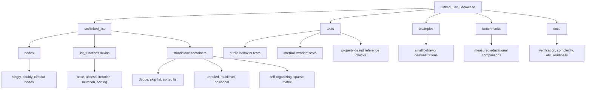

# Portfolio Showcase: Verification and Engineering Fundamentals

This document explains what Linked Structure Lab contributes to the portfolio
and how it should be reviewed in a modern AI-assisted development context.

## One-Minute Summary

Linked Structure Lab is not the flagship applied-AI project in this portfolio.
It is an engineering-fundamentals lab built around linked data structures,
mutation invariants, property-based testing, and verification discipline.

The project began as a deliberately exhaustive response to classic linked-list
interview preparation. It later expanded into a typed Python package with
multiple linked structures, examples, benchmarks, CI, regression tests, and
randomized reference-model comparisons.

AI coding assistance was used during development. Accordingly, the project does
not ask a reviewer to infer ability from code volume or assume every line was
manually authored. The relevant question is whether the behavior is specified
well enough to detect incorrect implementations and whether the project owner
can explain the resulting design, tests, tradeoffs, and failure modes.

## What This Project Demonstrates

- Python package organization with a `src/` layout and `pyproject.toml`.
- Typed public APIs and a PEP 561 `py.typed` marker.
- Explicit structural invariants for linked containers.
- Unit, regression, edge-case, and property-based testing.
- Randomized comparisons with simpler Python reference models.
- 100% branch coverage over package source.
- CI, linting, formatting, and static typing.
- Benchmarks used as measured educational comparisons rather than vague claims.
- Technical documentation that explains why tests exist and what properties
  they establish.

## What This Project Does Not Claim

This project does not claim that production Python applications should replace
`list`, `collections.deque`, NumPy, SciPy, pandas, Redis, or maintained
collection libraries with hand-written linked structures.

It also does not claim that raw code volume proves programming skill. Modern AI
coding tools make that inference unreliable. The project is more useful as a
controlled environment for asking a different question:

> How do you establish that a plausible implementation is actually correct?

That question remains relevant whether the first draft was typed manually,
generated by an AI coding agent, adapted from documentation, or produced by a
team member.

## Verification Model

The test suite goes beyond checking final output values. It also checks hidden
structural state and cross-view consistency.

Examples include:

- `head`, `tail`, and `_size` remain consistent;
- forward and backward links agree after mutation;
- circular lists restore wraparound links;
- removed nodes are detached from invalid old relationships;
- positional handles become invalid after deletion or clearing;
- skip-list levels stay sorted and agree with bottom-level values;
- sparse-matrix row and column chains contain the same node objects;
- randomized operation sequences continue to match simpler Python `list`,
  `set`, or dense-matrix reference behavior.

These properties provide an independent oracle against which an implementation
can be judged. That is the central engineering value of the project.

## Reviewer Path

Recommended review order:

1. Read the first screen of `README.md` for the current positioning.
2. Skim the reviewer table that maps each structure to its verification focus.
3. Open `src/linked_list/list_functions/mutation.py` to inspect pointer repair.
4. Open one standalone structure such as `skip_list.py`, `unrolled_list.py`, or
   `sparse_matrix.py`.
5. Open its matching tests and identify the invariants being asserted.
6. Run the test and coverage commands.
7. Run a benchmark or example and compare implementation behavior with the
   documented expectations.

Fast commands:

```bash
python -m pip install -e ".[dev]"
python -m pytest
python -m coverage run -m pytest
python -m coverage report
python examples/product_ops_demo.py
python benchmarks/benchmark_structures.py
```

## Architecture Tour


```mermaid
flowchart TD
    A["Linked_List_Showcase"] --> B["src/linked_list"]
    A --> C["tests"]
    A --> D["examples"]
    A --> E["benchmarks"]
    A --> F["docs"]

    B --> G["nodes"]
    B --> H["list_functions mixins"]
    B --> I["standalone containers"]

    G --> G1["singly, doubly, circular nodes"]
    H --> H1["base, access, iteration, mutation, sorting"]
    I --> I1["deque, skip list, sorted list"]
    I --> I2["unrolled, multilevel, positional"]
    I --> I3["self-organizing, sparse matrix"]

    C --> C1["public behavior tests"]
    C --> C2["internal invariant tests"]
    C --> C3["property-based reference checks"]

    D --> D1["small behavior demonstrations"]
    E --> E1["measured educational comparisons"]
    F --> F1["verification, complexity, API, readiness"]
```

## Project Scorecard

| Area | Evidence in this project |
| --- | --- |
| Structural reasoning | Classic, circular, sorted, deque, skip-list, unrolled, multilevel, positional, self-organizing, and sparse-matrix variants |
| API design | Shared sequence behavior plus structure-specific operations such as `floor`, `ceiling`, `to_blocks`, `positions`, and matrix arithmetic |
| Verification | Invariant checks, property-based tests, randomized reference comparisons, regression tests, and 100% branch coverage |
| Static quality | Ruff linting, Ruff formatting, mypy, Python 3.12+ CI, and typed package marker |
| Measurement | Benchmarks with documented interpretation rather than unsupported performance claims |
| Documentation | README, demo script, API reference, complexity guide, source walkthrough, package readiness guide |

## How To Discuss This Project In An Interview

Useful framing:

- "I originally built it because I was tired of repeatedly preparing the same
  linked-list interview material, so I turned the topic into a more complete
  verification exercise."
- "I used AI coding assistance, so I do not present line count as evidence of
  skill. I present the invariants, tests, benchmarks, and design decisions."
- "The tests check internal pointer relationships, not only returned values."
- "Property-based tests compare randomized operation sequences with simpler
  reference models, which helps catch plausible but incorrect implementations."
- "The sparse matrix is a useful example because one node participates in both
  a row chain and a column chain, so mutations have to preserve two linked
  views simultaneously."
- "The project is intentionally finished. I would spend new portfolio effort
  on applied AI and data systems rather than inventing more list variants."

## Current Portfolio Role

This project should remain in the portfolio as supporting evidence of software
engineering fundamentals and verification discipline. It should not outrank
applied data-science, ML, retrieval, evaluation, or production-oriented
projects on the main portfolio landing page.

No additional linked-structure breadth is currently needed. Future maintenance
should focus only on correctness, compatibility, documentation accuracy, or
clearer reviewer navigation.
